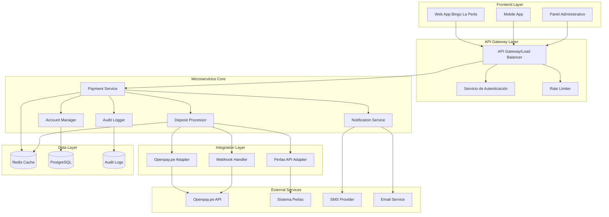
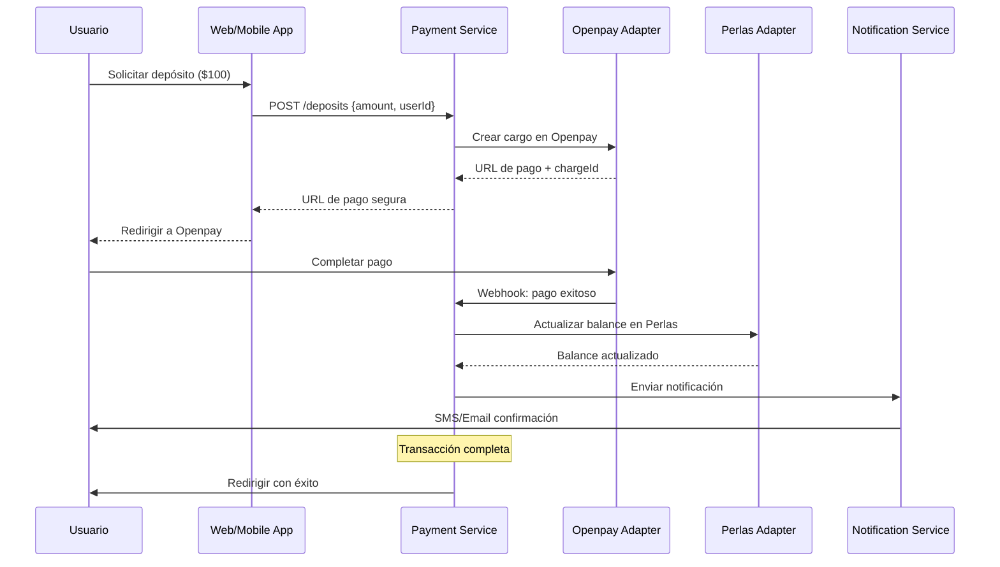

# Sistema de Integración Openpay.pe - Perlas
## Arquitectura de Automatización de Depósitos para Bingo La Perla

### Visión General del Sistema
El sistema integra la pasarela de pagos Openpay.pe con el sistema Perlas existente para automatizar completamente los depósitos de usuarios en Bingo La Perla, eliminando procesos manuales y mejorando la experiencia del cliente.

### Arquitectura del Sistema

### Componentes Principales

#### 1. Payment Service (Servicio de Pagos)
- **Responsabilidades**: Orquestar transacciones de depósito
- **Tecnología**: Node.js/TypeScript con Express
- **Funciones**:
  - Validar solicitudes de depósito
  - Coordinar con Openpay.pe
  - Actualizar cuentas en Perlas
  - Manejar callbacks y webhooks

#### 2. Deposit Processor (Procesador de Depósitos)
- **Responsabilidades**: Lógica de negocio para depósitos
- **Tecnología**: Node.js/TypeScript con Queue System
- **Funciones**:
  - Procesar pagos asincrónicos
  - Aplicar reglas de negocio
  - Manejar reintentos automáticos
  - Generar reportes

#### 3. Account Manager (Gestor de Cuentas)
- **Responsabilidades**: Gestión de cuentas de usuario
- **Tecnología**: Node.js/TypeScript con ORM
- **Funciones**:
  - Sincronizar balances con Perlas
  - Manejar límites de depósito
  - Historial de transacciones
  - Validaciones KYC básicas

#### 4. Notification Service (Servicio de Notificaciones)
- **Responsabilidades**: Comunicaciones con usuarios
- **Tecnología**: Node.js/TypeScript con Queue System
- **Funciones**:
  - SMS de confirmación
  - Emails de transacciones
  - Push notifications
  - Alertas administrativas

### Flujo de Depósito Automatizado

### Patrones Arquitectónicos Implementados

#### 1. Microservicios
- Servicios independientes y desplegables
- Comunicación vía HTTP/REST y eventos
- Escalabilidad horizontal individual

#### 2. Event-Driven Architecture
- Eventos de dominio para desacoplamiento
- Queue system para procesamiento asíncrono
- Saga pattern para transacciones distribuidas

#### 3. API-First Design
- Contratos OpenAPI definidos
- Versionado semántico
- Documentación automática

#### 4. Circuit Breaker Pattern
- Protección contra fallos en cascada
- Timeouts y reintentos configurables
- Fallback strategies

### Consideraciones de Seguridad

#### Autenticación y Autorización
- JWT tokens con refresh mechanism
- OAuth2 para integraciones externas
- RBAC para diferentes niveles de acceso

#### Protección de Datos
- Encriptación AES-256 para datos sensibles
- PCI DSS compliance para datos de pago
- Tokenización de información financiera
- HTTPS obligatorio en todas las comunicaciones

#### API Security
- Rate limiting por usuario/IP
- API keys rotables
- Request signing con HMAC
- Validación de webhook signatures

### Resiliencia y Disponibilidad

#### Tolerancia a Fallos
- Retry policies con exponential backoff
- Dead letter queues para errores
- Health checks automatizados
- Graceful degradation

#### Monitoreo
- Métricas en tiempo real (Prometheus)
- Logging estructurado (ELK Stack)
- Alertas proactivas
- Dashboard de operaciones

### Escalabilidad

#### Horizontal Scaling
- Load balancing con NGINX
- Auto-scaling basado en métricas
- Database read replicas
- CDN para assets estáticos

#### Performance Optimization
- Redis para caching
- Connection pooling
- Lazy loading
- Compresión gzip/brotli