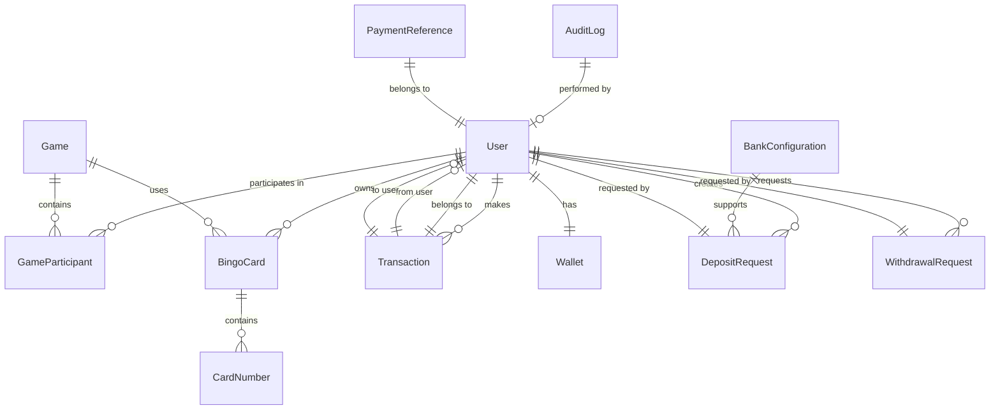

# Data Models & Database Schema - Bingo La Perla

## 🗃️ Database Overview

### Technology Stack
- **Development**: SQLite 3
- **Production**: PostgreSQL (recommended)
- **ORM**: Prisma 5.7.1
- **Migration Strategy**: Prisma Migrate
- **Backup Strategy**: Automated daily backups with retention

### Schema Statistics
- **Tables**: 15 entities
- **Relationships**: 25+ foreign key relationships
- **Indexes**: Optimized for performance
- **Constraints**: Data integrity enforced
- **Audit Trail**: Complete transaction logging

## 📊 Core Entity Relationship Diagram



## 👤 User Management Schema

### User Entity
```sql
CREATE TABLE users (
    id                TEXT PRIMARY KEY,           -- CUID
    email             TEXT UNIQUE NOT NULL,
    username          TEXT UNIQUE NOT NULL,
    password          TEXT NOT NULL,              -- bcrypt hash
    role              TEXT DEFAULT 'USER',        -- USER | ADMIN
    balance           DECIMAL(10,2) DEFAULT 0.00, -- Legacy balance
    pearlsBalance     DECIMAL(10,2) DEFAULT 0.00, -- Current balance in Perlas
    isActive          BOOLEAN DEFAULT true,
    isVerified        BOOLEAN DEFAULT false,
    
    -- KYC Information
    fullName          TEXT,
    phone             TEXT,
    dni               TEXT UNIQUE,                -- Peru DNI
    birthDate         DATETIME,
    
    -- Timestamps
    createdAt         DATETIME DEFAULT CURRENT_TIMESTAMP,
    updatedAt         DATETIME DEFAULT CURRENT_TIMESTAMP
);
```

**Business Rules:**
- Email must be unique and valid format
- Username 3-20 characters, alphanumeric + underscore
- Password minimum 8 characters with complexity requirements
- DNI format validation for Peruvian identification
- Role-based access control (RBAC)

### Wallet Entity
```sql
CREATE TABLE wallets (
    id                TEXT PRIMARY KEY,
    userId            TEXT UNIQUE NOT NULL,
    balance           DECIMAL(10,2) DEFAULT 0.00, -- Balance in Perlas
    dailyLimit        DECIMAL(10,2) DEFAULT 1000.00,
    monthlyLimit      DECIMAL(10,2) DEFAULT 10000.00,
    isActive          BOOLEAN DEFAULT true,
    isFrozen          BOOLEAN DEFAULT false,     -- For security holds
    createdAt         DATETIME DEFAULT CURRENT_TIMESTAMP,
    updatedAt         DATETIME DEFAULT CURRENT_TIMESTAMP,
    
    FOREIGN KEY (userId) REFERENCES users(id) ON DELETE CASCADE
);
```

**Business Rules:**
- One wallet per user
- Limits enforced at application level
- Frozen status prevents all operations
- Audit trail for all balance changes

## 🎮 Game Management Schema

### Game Entity
```sql
CREATE TABLE games (
    id                TEXT PRIMARY KEY,
    title             TEXT NOT NULL,
    description       TEXT,
    maxPlayers        INTEGER DEFAULT 500,
    cardPrice         DECIMAL(10,2) DEFAULT 5.00,
    totalPrize        DECIMAL(10,2) DEFAULT 0.00,
    status            TEXT DEFAULT 'SCHEDULED',   -- SCHEDULED | OPEN | IN_PROGRESS | PAUSED | COMPLETED | CANCELLED
    
    -- Scheduling
    scheduledAt       DATETIME NOT NULL,
    startedAt         DATETIME,
    endedAt           DATETIME,
    
    -- Game State
    ballsDrawn        TEXT DEFAULT '[]',          -- JSON array of drawn numbers
    currentBall       INTEGER,
    winningCards      TEXT DEFAULT '[]',          -- JSON array of winning card IDs
    
    -- Timestamps
    createdAt         DATETIME DEFAULT CURRENT_TIMESTAMP,
    updatedAt         DATETIME DEFAULT CURRENT_TIMESTAMP
);
```

**Game Status Flow:**
```
SCHEDULED → OPEN → IN_PROGRESS → COMPLETED
         ↓        ↓
    CANCELLED   PAUSED ↔ IN_PROGRESS
```

### Game Participant Entity
```sql
CREATE TABLE game_participants (
    id                TEXT PRIMARY KEY,
    userId            TEXT NOT NULL,
    gameId            TEXT NOT NULL,
    joinedAt          DATETIME DEFAULT CURRENT_TIMESTAMP,
    cardsCount        INTEGER DEFAULT 0,
    totalSpent        DECIMAL(10,2) DEFAULT 0.00,
    hasWon            BOOLEAN DEFAULT false,
    prizeWon          DECIMAL(10,2) DEFAULT 0.00,
    
    FOREIGN KEY (userId) REFERENCES users(id) ON DELETE CASCADE,
    FOREIGN KEY (gameId) REFERENCES games(id) ON DELETE CASCADE,
    UNIQUE(userId, gameId)
);
```

## 🎫 Bingo Card Schema

### Bingo Card Entity
```sql
CREATE TABLE bingo_cards (
    id                TEXT PRIMARY KEY,
    userId            TEXT NOT NULL,
    gameId            TEXT NOT NULL,
    cardNumber        INTEGER NOT NULL,           -- Sequential card number in game
    isActive          BOOLEAN DEFAULT true,
    markedNumbers     TEXT DEFAULT '[]',          -- JSON array of marked positions
    isWinner          BOOLEAN DEFAULT false,
    winningPattern    TEXT,                       -- Winning pattern type
    createdAt         DATETIME DEFAULT CURRENT_TIMESTAMP,
    updatedAt         DATETIME DEFAULT CURRENT_TIMESTAMP,
    
    FOREIGN KEY (userId) REFERENCES users(id) ON DELETE CASCADE,
    FOREIGN KEY (gameId) REFERENCES games(id) ON DELETE CASCADE,
    UNIQUE(gameId, cardNumber)
);
```

### Card Number Entity
```sql
CREATE TABLE card_numbers (
    id                TEXT PRIMARY KEY,
    cardId            TEXT NOT NULL,
    position          INTEGER NOT NULL,           -- 0-24 grid position
    column            TEXT NOT NULL,              -- B | I | N | G | O
    number            INTEGER,                    -- NULL for free center space
    isMarked          BOOLEAN DEFAULT false,
    isFree            BOOLEAN DEFAULT false,      -- Center space (position 12)
    
    FOREIGN KEY (cardId) REFERENCES bingo_cards(id) ON DELETE CASCADE,
    UNIQUE(cardId, position)
);
```

**Bingo Card Layout:**
```
B  I  N  G  O
1  16 31 46 61
2  17 32 47 62
3  18 [F] 48 63  -- [F] = Free center space
4  19 33 49 64
5  20 34 50 65
```

**Business Rules:**
- B column: 1-15, I column: 16-30, N column: 31-45 (except center), G column: 46-60, O column: 61-75
- Center space (position 12) is always free
- Each card has unique numbers in each column range
- Maximum 5 cards per player per game

## 💰 Financial Schema (Sistema Perlas)

### Transaction Entity
```sql
CREATE TABLE transactions (
    id                TEXT PRIMARY KEY,
    userId            TEXT NOT NULL,
    gameId            TEXT,                       -- NULL for non-game transactions
    type              TEXT NOT NULL,              -- CARD_PURCHASE | PRIZE_PAYOUT | REFUND | PEARL_PURCHASE | PEARL_TRANSFER | WITHDRAWAL
    amount            DECIMAL(10,2) NOT NULL,
    description       TEXT NOT NULL,
    status            TEXT DEFAULT 'PENDING',     -- PENDING | COMPLETED | FAILED | CANCELLED
    
    -- Payment Information
    paymentMethod     TEXT,
    paymentId         TEXT,
    
    -- Pearls System
    pearlsAmount      DECIMAL(10,2),
    fromUserId        TEXT,                       -- For P2P transfers
    toUserId          TEXT,                       -- For P2P transfers
    commissionAmount  DECIMAL(10,2) DEFAULT 0.00,
    referenceId       TEXT,                       -- Unique tracking reference
    
    -- Timestamps
    createdAt         DATETIME DEFAULT CURRENT_TIMESTAMP,
    updatedAt         DATETIME DEFAULT CURRENT_TIMESTAMP,
    
    FOREIGN KEY (userId) REFERENCES users(id) ON DELETE CASCADE,
    FOREIGN KEY (fromUserId) REFERENCES users(id) ON DELETE SET NULL,
    FOREIGN KEY (toUserId) REFERENCES users(id) ON DELETE SET NULL
);
```

### Deposit Request Entity
```sql
CREATE TABLE deposit_requests (
    id                TEXT PRIMARY KEY,
    userId            TEXT NOT NULL,
    amount            DECIMAL(10,2) NOT NULL,
    pearlsAmount      DECIMAL(10,2) NOT NULL,     -- Usually equal to amount
    currency          TEXT DEFAULT 'PEN',
    paymentMethod     TEXT NOT NULL,              -- BCP | BBVA | INTERBANK | SCOTIABANK | YAPE | PLIN
    
    -- References
    referenceCode     TEXT UNIQUE NOT NULL,       -- System generated
    bankReference     TEXT,                       -- User provided operation number
    
    -- Bank Account Information
    bankAccount       TEXT,
    bankAccountName   TEXT,
    
    -- Status and Validation
    status            TEXT DEFAULT 'PENDING',     -- PENDING | APPROVED | REJECTED | CANCELLED | EXPIRED
    adminNotes        TEXT,
    validatedBy       TEXT,                       -- Admin user ID
    validatedAt       DATETIME,
    
    -- Evidence
    proofImage        TEXT,                       -- User uploaded proof
    proofImageAdmin   TEXT,                       -- Admin verified proof
    
    -- Processing
    transactionId     TEXT,                       -- Created transaction ID when approved
    
    -- Timestamps
    createdAt         DATETIME DEFAULT CURRENT_TIMESTAMP,
    updatedAt         DATETIME DEFAULT CURRENT_TIMESTAMP,
    expiresAt         DATETIME NOT NULL,          -- 24 hours from creation
    
    FOREIGN KEY (userId) REFERENCES users(id) ON DELETE CASCADE
);
```

### Withdrawal Request Entity
```sql
CREATE TABLE withdrawal_requests (
    id                TEXT PRIMARY KEY,
    userId            TEXT NOT NULL,
    pearlsAmount      DECIMAL(10,2) NOT NULL,
    amountInSoles     DECIMAL(10,2) NOT NULL,
    commission        DECIMAL(10,2) DEFAULT 0.00,
    netAmount         DECIMAL(10,2) NOT NULL,     -- Amount after commission
    
    -- Bank Information
    bankCode          TEXT NOT NULL,              -- BCP | BBVA | INTERBANK | SCOTIABANK
    accountNumber     TEXT NOT NULL,
    accountType       TEXT NOT NULL,              -- SAVINGS | CHECKING
    accountHolderName TEXT NOT NULL,
    accountHolderDni  TEXT NOT NULL,
    
    -- Status and Processing
    status            TEXT DEFAULT 'PENDING',     -- PENDING | APPROVED | REJECTED | CANCELLED | PROCESSING | COMPLETED
    adminNotes        TEXT,
    processedBy       TEXT,                       -- Admin user ID
    processedAt       DATETIME,
    
    -- Bank Transaction
    bankTransactionId TEXT,
    transferProof     TEXT,                       -- Bank transfer proof
    
    -- References
    referenceCode     TEXT UNIQUE NOT NULL,
    transactionId     TEXT,                       -- Debit transaction ID
    
    -- Timestamps
    createdAt         DATETIME DEFAULT CURRENT_TIMESTAMP,
    updatedAt         DATETIME DEFAULT CURRENT_TIMESTAMP,
    
    FOREIGN KEY (userId) REFERENCES users(id) ON DELETE CASCADE
);
```

## 🏛️ Banking Configuration Schema

### Bank Configuration Entity
```sql
CREATE TABLE bank_configurations (
    id                TEXT PRIMARY KEY,
    bankCode          TEXT UNIQUE NOT NULL,       -- BCP | BBVA | INTERBANK | SCOTIABANK
    bankName          TEXT NOT NULL,
    
    -- Business Account Information
    accountNumber     TEXT NOT NULL,
    accountType       TEXT NOT NULL,              -- SAVINGS | CHECKING
    accountHolderName TEXT NOT NULL,
    cci               TEXT,                       -- Código Cuenta Interbancaria
    
    -- Configuration
    isActive          BOOLEAN DEFAULT true,
    minDeposit        DECIMAL(10,2) DEFAULT 1.00,
    maxDeposit        DECIMAL(10,2) DEFAULT 5000.00,
    depositCommission DECIMAL(10,2) DEFAULT 0.00,
    
    -- Instructions
    instructions      TEXT,
    
    -- Timestamps
    createdAt         DATETIME DEFAULT CURRENT_TIMESTAMP,
    updatedAt         DATETIME DEFAULT CURRENT_TIMESTAMP
);
```

### Payment Reference Entity
```sql
CREATE TABLE payment_references (
    id                TEXT PRIMARY KEY,
    code              TEXT UNIQUE NOT NULL,       -- Alphanumeric unique code
    type              TEXT NOT NULL,              -- DEPOSIT | WITHDRAWAL | TRANSFER
    userId            TEXT NOT NULL,
    amount            DECIMAL(10,2) NOT NULL,
    description       TEXT NOT NULL,
    metadata          TEXT,                       -- JSON metadata
    isUsed            BOOLEAN DEFAULT false,
    usedAt            DATETIME,
    createdAt         DATETIME DEFAULT CURRENT_TIMESTAMP,
    updatedAt         DATETIME DEFAULT CURRENT_TIMESTAMP,
    expiresAt         DATETIME NOT NULL,
    
    FOREIGN KEY (userId) REFERENCES users(id) ON DELETE CASCADE
);
```

## 🔍 Audit & Compliance Schema

### Audit Log Entity
```sql
CREATE TABLE audit_logs (
    id                TEXT PRIMARY KEY,
    userId            TEXT,                       -- User who performed action
    adminId           TEXT,                       -- Admin who performed action
    action            TEXT NOT NULL,              -- Action type
    entity            TEXT NOT NULL,              -- Affected entity type
    entityId          TEXT NOT NULL,              -- Affected entity ID
    oldValue          TEXT,                       -- Previous value (JSON)
    newValue          TEXT,                       -- New value (JSON)
    description       TEXT NOT NULL,
    ipAddress         TEXT,
    userAgent         TEXT,
    sessionId         TEXT,
    createdAt         DATETIME DEFAULT CURRENT_TIMESTAMP
);
```

**Audit Trail Coverage:**
- User registration and profile changes
- All financial transactions
- Game participation and results
- Administrative actions
- Security events (login attempts, password changes)
- System configuration changes

### Payment Configuration Entity
```sql
CREATE TABLE payment_configurations (
    id                    TEXT PRIMARY KEY,
    
    -- P2P Transfer Settings
    p2pTransferEnabled    BOOLEAN DEFAULT true,
    p2pTransferCommission DECIMAL(10,2) DEFAULT 0.50,
    
    -- Default Limits
    defaultDailyLimit     DECIMAL(10,2) DEFAULT 1000.00,
    defaultMonthlyLimit   DECIMAL(10,2) DEFAULT 10000.00,
    
    -- Timeouts
    depositExpirationHours    INTEGER DEFAULT 24,
    referenceExpirationHours  INTEGER DEFAULT 48,
    
    -- System Status
    depositsEnabled       BOOLEAN DEFAULT true,
    withdrawalsEnabled    BOOLEAN DEFAULT true,
    transfersEnabled      BOOLEAN DEFAULT true,
    
    -- Messages
    maintenanceMessage    TEXT,
    announcementMessage   TEXT,
    
    -- Timestamps
    createdAt             DATETIME DEFAULT CURRENT_TIMESTAMP,
    updatedAt             DATETIME DEFAULT CURRENT_TIMESTAMP
);
```

## 📊 Data Relationships Summary

### Primary Relationships
1. **User ↔ Wallet**: One-to-One relationship
2. **User ↔ Game**: Many-to-Many via GameParticipant
3. **Game ↔ BingoCard**: One-to-Many
4. **BingoCard ↔ CardNumber**: One-to-Many (25 numbers per card)
5. **User ↔ Transaction**: One-to-Many
6. **User ↔ DepositRequest**: One-to-Many
7. **User ↔ WithdrawalRequest**: One-to-Many

### Foreign Key Constraints
- **CASCADE**: User deletion cascades to related entities
- **SET NULL**: Optional references become null on deletion
- **RESTRICT**: Prevent deletion if referenced

### Indexes for Performance
```sql
-- User indexes
CREATE INDEX idx_users_email ON users(email);
CREATE INDEX idx_users_username ON users(username);
CREATE INDEX idx_users_dni ON users(dni);

-- Game indexes
CREATE INDEX idx_games_status ON games(status);
CREATE INDEX idx_games_scheduled_at ON games(scheduledAt);

-- Transaction indexes
CREATE INDEX idx_transactions_user_id ON transactions(userId);
CREATE INDEX idx_transactions_created_at ON transactions(createdAt);
CREATE INDEX idx_transactions_type ON transactions(type);
CREATE INDEX idx_transactions_status ON transactions(status);

-- Bingo card indexes
CREATE INDEX idx_bingo_cards_user_game ON bingo_cards(userId, gameId);
CREATE INDEX idx_bingo_cards_game_id ON bingo_cards(gameId);

-- Audit log indexes
CREATE INDEX idx_audit_logs_user_id ON audit_logs(userId);
CREATE INDEX idx_audit_logs_created_at ON audit_logs(createdAt);
CREATE INDEX idx_audit_logs_action ON audit_logs(action);
```

## 🔒 Data Security & Privacy

### Encryption Strategy
- **Passwords**: bcrypt with 12 salt rounds
- **Sensitive Data**: AES-256 encryption for PII
- **Tokens**: JWT with strong secret keys
- **Database**: TDE (Transparent Data Encryption) for production

### PII Handling
- **DNI**: Encrypted at rest
- **Bank Details**: Encrypted and tokenized
- **Phone Numbers**: Hashed for lookup, encrypted for storage
- **Audit Trail**: Full GDPR compliance with retention policies

### Backup Strategy
- **Daily**: Automated encrypted backups
- **Weekly**: Full system backup with integrity checks
- **Monthly**: Archive to cold storage
- **Retention**: 7 years for financial compliance

---

**Database Schema Version**: 1.0.0
**Last Updated**: ${new Date().toLocaleDateString('es-PE')}
**Prisma Schema**: Located at `/backend/prisma/schema.prisma`