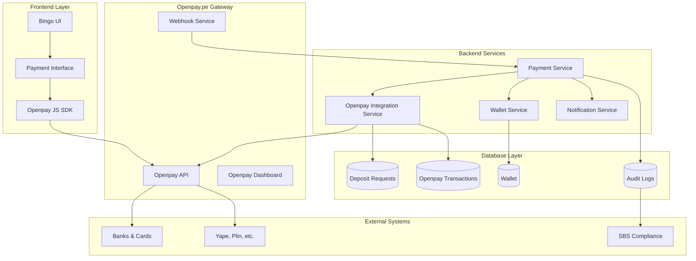

# Openpay.pe Integration Architecture - Bingo La Perla

## 🎯 Executive Summary

Este documento presenta la arquitectura de integración de Openpay.pe con el sistema de Perlas de Bingo La Perla para automatizar completamente el proceso de depósitos, eliminando la validación manual y proporcionando una experiencia de usuario fluida con confirmación instantánea.

### Objetivos de la Integración
1. **Automatización Completa**: Eliminar validación manual de depósitos
2. **Tiempo Real**: Confirmación instantánea de pagos via webhooks
3. **Múltiples Métodos**: Tarjetas, transferencias, billeteras digitales
4. **Compliance**: Cumplimiento SBS y anti-lavado de dinero
5. **Escalabilidad**: Procesamiento de alto volumen

## 🏗️ Arquitectura de Integración



## 💳 Openpay.pe Specifications

### Supported Payment Methods in Peru
```typescript
enum OpenpayPaymentMethod {
  CREDIT_CARD = 'card',           // Visa, MasterCard, Diners
  DEBIT_CARD = 'debit_card',      // Débito nacional
  BANK_TRANSFER = 'bank_account', // Transferencias bancarias
  CASH_PAYMENT = 'store',         // PagoEfectivo, TamboPlus
  DIGITAL_WALLET = 'wallet'       // Yape, Plin integration
}

interface OpenpayPeruConfig {
  country: 'PE';
  currency: 'PEN';
  merchantId: string;
  publicKey: string;
  privateKey: string;
  webhookUrl: string;
  environment: 'sandbox' | 'production';
}
```

### API Authentication & Configuration
```typescript
// backend/src/config/openpay.ts
import Openpay from 'openpay';

export const openpayConfig: OpenpayPeruConfig = {
  country: 'PE',
  currency: 'PEN',
  merchantId: process.env.OPENPAY_MERCHANT_ID!,
  publicKey: process.env.OPENPAY_PUBLIC_KEY!,
  privateKey: process.env.OPENPAY_PRIVATE_KEY!,
  webhookUrl: `${process.env.BACKEND_URL}/api/webhooks/openpay`,
  environment: process.env.NODE_ENV === 'production' ? 'production' : 'sandbox'
};

export const openpayClient = new Openpay(
  openpayConfig.merchantId,
  openpayConfig.privateKey,
  openpayConfig.country
);
```

## 🗃️ Database Schema Extensions

### Openpay Transaction Table
```sql
-- Extensión para transacciones Openpay
CREATE TABLE openpay_transactions (
    id                    TEXT PRIMARY KEY,
    deposit_request_id    TEXT NOT NULL,
    openpay_transaction_id TEXT UNIQUE NOT NULL,
    openpay_charge_id     TEXT UNIQUE,
    
    -- Payment Details
    amount                DECIMAL(10,2) NOT NULL,
    currency              TEXT DEFAULT 'PEN',
    payment_method        TEXT NOT NULL, -- card, bank_account, store, wallet
    payment_method_details JSON,         -- Card info, bank details, etc.
    
    -- Openpay Status
    openpay_status        TEXT NOT NULL, -- charge_pending, completed, failed, cancelled
    openpay_error_code    TEXT,
    openpay_error_message TEXT,
    
    -- Customer Information
    customer_id           TEXT NOT NULL, -- Openpay customer ID
    customer_email        TEXT NOT NULL,
    customer_phone        TEXT,
    
    -- Processing Information
    authorization_code    TEXT,
    operation_type        TEXT,         -- card, transfer, cash, wallet
    device_session_id     TEXT,
    
    -- Security & Fraud
    risk_score           DECIMAL(3,2),
    fraud_indicators     JSON,
    ip_address           TEXT,
    user_agent           TEXT,
    
    -- Timestamps
    charged_at           DATETIME,
    expires_at           DATETIME,
    created_at           DATETIME DEFAULT CURRENT_TIMESTAMP,
    updated_at           DATETIME DEFAULT CURRENT_TIMESTAMP,
    
    FOREIGN KEY (deposit_request_id) REFERENCES deposit_requests(id) ON DELETE CASCADE
);

-- Webhook events log
CREATE TABLE openpay_webhook_events (
    id                TEXT PRIMARY KEY,
    openpay_event_id  TEXT UNIQUE NOT NULL,
    event_type        TEXT NOT NULL,      -- charge.succeeded, charge.failed, etc.
    transaction_id    TEXT,
    webhook_signature TEXT NOT NULL,
    payload           JSON NOT NULL,
    processed_at      DATETIME,
    processing_status TEXT DEFAULT 'pending', -- pending, processed, failed
    error_message     TEXT,
    created_at        DATETIME DEFAULT CURRENT_TIMESTAMP,
    
    FOREIGN KEY (transaction_id) REFERENCES openpay_transactions(id) ON DELETE SET NULL
);

-- Customer management
CREATE TABLE openpay_customers (
    id               TEXT PRIMARY KEY,
    user_id          TEXT NOT NULL,
    openpay_customer_id TEXT UNIQUE NOT NULL,
    email            TEXT NOT NULL,
    name             TEXT NOT NULL,
    phone            TEXT,
    created_at       DATETIME DEFAULT CURRENT_TIMESTAMP,
    updated_at       DATETIME DEFAULT CURRENT_TIMESTAMP,
    
    FOREIGN KEY (user_id) REFERENCES users(id) ON DELETE CASCADE
);

-- Payment methods storage
CREATE TABLE openpay_payment_methods (
    id                  TEXT PRIMARY KEY,
    customer_id         TEXT NOT NULL,
    openpay_card_id     TEXT UNIQUE,
    
    -- Card Information (tokenized)
    card_type           TEXT,           -- credit, debit
    card_brand          TEXT,           -- visa, mastercard, diners
    card_number_masked  TEXT,           -- **** **** **** 1234
    card_holder_name    TEXT,
    expiration_month    TEXT,
    expiration_year     TEXT,
    
    -- Status
    is_active          BOOLEAN DEFAULT true,
    is_default         BOOLEAN DEFAULT false,
    
    -- Timestamps
    created_at         DATETIME DEFAULT CURRENT_TIMESTAMP,
    updated_at         DATETIME DEFAULT CURRENT_TIMESTAMP,
    
    FOREIGN KEY (customer_id) REFERENCES openpay_customers(id) ON DELETE CASCADE
);
```

### Enhanced Deposit Request Schema
```sql
-- Modificación de la tabla existente
ALTER TABLE deposit_requests ADD COLUMN integration_method TEXT DEFAULT 'manual'; -- 'manual', 'openpay'
ALTER TABLE deposit_requests ADD COLUMN openpay_transaction_id TEXT;
ALTER TABLE deposit_requests ADD COLUMN auto_approval_eligible BOOLEAN DEFAULT false;
ALTER TABLE deposit_requests ADD COLUMN processing_fee DECIMAL(10,2) DEFAULT 0.00;

-- Índices para performance
CREATE INDEX idx_openpay_transactions_deposit ON openpay_transactions(deposit_request_id);
CREATE INDEX idx_openpay_transactions_status ON openpay_transactions(openpay_status);
CREATE INDEX idx_openpay_webhooks_event ON openpay_webhook_events(event_type, processed_at);
CREATE INDEX idx_openpay_customers_user ON openpay_customers(user_id);
```

## 🔄 Payment Flow Architecture

### 1. Frontend Payment Interface
```typescript
// frontend/src/components/payment/OpenpayPaymentModal.tsx
interface OpenpayPaymentModalProps {
  isOpen: boolean;
  onClose: () => void;
  depositAmount: number;
  onPaymentSuccess: (transactionId: string) => void;
}

export function OpenpayPaymentModal({
  isOpen,
  onClose,
  depositAmount,
  onPaymentSuccess
}: OpenpayPaymentModalProps) {
  const [selectedMethod, setSelectedMethod] = useState<PaymentMethod>('card');
  const [isProcessing, setIsProcessing] = useState(false);
  const [deviceSessionId] = useState(() => generateDeviceSessionId());

  const handleCardPayment = async (cardData: CardData) => {
    setIsProcessing(true);
    try {
      // 1. Create Openpay token with card data
      const token = await createOpenpayToken(cardData);
      
      // 2. Process payment through backend
      const result = await processOpenpayPayment({
        amount: depositAmount,
        token: token.id,
        deviceSessionId,
        paymentMethod: 'card'
      });
      
      // 3. Show success and update UI
      onPaymentSuccess(result.transactionId);
      toast.success('¡Pago procesado exitosamente! Perlas agregadas a tu cuenta.');
      
    } catch (error) {
      handlePaymentError(error);
    } finally {
      setIsProcessing(false);
    }
  };

  return (
    <Modal isOpen={isOpen} onClose={onClose} size="lg">
      <div className="p-6">
        <h2 className="text-2xl font-bold mb-4">
          Depositar {formatCurrency(depositAmount)} Soles
        </h2>
        
        <PaymentMethodSelector
          selectedMethod={selectedMethod}
          onMethodChange={setSelectedMethod}
        />
        
        {selectedMethod === 'card' && (
          <CreditCardForm
            onSubmit={handleCardPayment}
            isProcessing={isProcessing}
          />
        )}
        
        {selectedMethod === 'bank_transfer' && (
          <BankTransferForm
            amount={depositAmount}
            onSubmit={handleBankTransfer}
          />
        )}
        
        {selectedMethod === 'cash' && (
          <CashPaymentInstructions
            amount={depositAmount}
            onConfirm={handleCashPayment}
          />
        )}
        
        <div className="mt-6 p-4 bg-blue-50 rounded-lg">
          <div className="flex items-center text-blue-700">
            <ShieldIcon className="h-5 w-5 mr-2" />
            <span className="text-sm">
              Pagos seguros procesados por Openpay.pe - PCI DSS Nivel 1
            </span>
          </div>
        </div>
      </div>
    </Modal>
  );
}
```

### 2. Backend Payment Processing Service
```typescript
// backend/src/services/openpayService.ts
export class OpenpayService {
  private openpay: Openpay;
  
  constructor() {
    this.openpay = new Openpay(
      openpayConfig.merchantId,
      openpayConfig.privateKey,
      openpayConfig.country
    );
  }

  async processCardPayment(paymentData: CardPaymentData): Promise<OpenpayTransactionResult> {
    try {
      // 1. Create or get Openpay customer
      const customer = await this.ensureOpenpayCustomer(paymentData.userId);
      
      // 2. Create deposit request
      const depositRequest = await this.createDepositRequest({
        userId: paymentData.userId,
        amount: paymentData.amount,
        integrationMethod: 'openpay',
        autoApprovalEligible: true
      });

      // 3. Create Openpay charge
      const chargeRequest = {
        source_id: paymentData.token,
        method: 'card',
        amount: paymentData.amount,
        currency: 'pen',
        description: `Depósito Bingo La Perla - ${depositRequest.referenceCode}`,
        device_session_id: paymentData.deviceSessionId,
        customer: {
          id: customer.openpayCustomerId
        },
        confirm: true,
        send_email: false
      };

      const charge = await this.openpay.charges.create(chargeRequest);
      
      // 4. Save transaction record
      const transaction = await this.saveOpenpayTransaction({
        depositRequestId: depositRequest.id,
        openpayTransactionId: charge.id,
        openpayChargeId: charge.id,
        amount: paymentData.amount,
        paymentMethod: 'card',
        paymentMethodDetails: {
          cardBrand: charge.card?.brand,
          cardLast4: charge.card?.card_number,
          cardType: charge.card?.type
        },
        openpayStatus: charge.status,
        customerId: customer.openpayCustomerId,
        customerEmail: paymentData.customerEmail,
        authorizationCode: charge.authorization,
        operationType: 'card',
        deviceSessionId: paymentData.deviceSessionId,
        chargedAt: charge.creation_date ? new Date(charge.creation_date) : null
      });

      // 5. If charge successful, auto-approve deposit
      if (charge.status === 'completed') {
        await this.autoApproveDeposit(depositRequest.id, transaction.id);
      }

      return {
        success: true,
        transactionId: transaction.id,
        openpayChargeId: charge.id,
        status: charge.status,
        authorizationCode: charge.authorization
      };

    } catch (error) {
      logger.error('Openpay payment processing failed', error);
      throw new OpenpayError('Payment processing failed', error);
    }
  }

  async processBankTransfer(paymentData: BankTransferData): Promise<OpenpayTransactionResult> {
    try {
      const customer = await this.ensureOpenpayCustomer(paymentData.userId);
      
      const chargeRequest = {
        method: 'bank_account',
        amount: paymentData.amount,
        currency: 'pen',
        description: `Depósito Bingo La Perla`,
        customer: {
          id: customer.openpayCustomerId
        }
      };

      const charge = await this.openpay.charges.create(chargeRequest);
      
      // Return payment instructions to user
      return {
        success: true,
        transactionId: charge.id,
        paymentInstructions: {
          bankName: charge.payment_method?.bank,
          accountNumber: charge.payment_method?.clabe,
          reference: charge.payment_method?.reference,
          expirationDate: charge.due_date
        }
      };

    } catch (error) {
      logger.error('Bank transfer creation failed', error);
      throw new OpenpayError('Bank transfer creation failed', error);
    }
  }

  private async ensureOpenpayCustomer(userId: string): Promise<OpenpayCustomer> {
    // Check if customer exists
    let customer = await prisma.openpayCustomer.findUnique({
      where: { userId }
    });

    if (!customer) {
      // Create new Openpay customer
      const user = await prisma.user.findUnique({ where: { id: userId } });
      if (!user) throw new Error('User not found');

      const openpayCustomer = await this.openpay.customers.create({
        name: user.fullName || user.username,
        email: user.email,
        phone_number: user.phone,
        external_id: userId
      });

      customer = await prisma.openpayCustomer.create({
        data: {
          userId,
          openpayCustomerId: openpayCustomer.id,
          email: user.email,
          name: user.fullName || user.username,
          phone: user.phone
        }
      });
    }

    return customer;
  }

  private async autoApproveDeposit(depositRequestId: string, transactionId: string): Promise<void> {
    await prisma.$transaction(async (tx) => {
      // Update deposit request
      const depositRequest = await tx.depositRequest.update({
        where: { id: depositRequestId },
        data: {
          status: 'APPROVED',
          validatedAt: new Date(),
          validatedBy: 'SYSTEM_OPENPAY',
          adminNotes: 'Auto-aprobado por pago exitoso Openpay',
          transactionId
        }
      });

      // Create transaction record
      await tx.transaction.create({
        data: {
          userId: depositRequest.userId,
          type: 'PEARL_PURCHASE',
          amount: depositRequest.amount,
          pearlsAmount: depositRequest.pearlsAmount,
          description: `Depósito automático Openpay - ${depositRequest.referenceCode}`,
          status: 'COMPLETED',
          paymentMethod: 'OPENPAY',
          referenceId: depositRequest.referenceCode
        }
      });

      // Update user wallet
      const user = await tx.user.findUnique({ where: { id: depositRequest.userId } });
      await tx.user.update({
        where: { id: depositRequest.userId },
        data: {
          pearlsBalance: {
            increment: depositRequest.pearlsAmount
          }
        }
      });

      // Update wallet record
      await tx.wallet.update({
        where: { userId: depositRequest.userId },
        data: {
          balance: {
            increment: depositRequest.pearlsAmount
          }
        }
      });

      // Create audit log
      await this.createAuditLog({
        action: 'OPENPAY_DEPOSIT_APPROVED',
        userId: depositRequest.userId,
        entityId: depositRequest.id,
        description: `Depósito automático aprobado: ${depositRequest.amount} PEN → ${depositRequest.pearlsAmount} Perlas`,
        metadata: { transactionId, openpayIntegration: true }
      });
    });

    // Send real-time notification
    await this.notificationService.sendDepositConfirmation(depositRequest.userId, {
      amount: depositRequest.amount,
      pearlsAmount: depositRequest.pearlsAmount,
      method: 'Openpay',
      instant: true
    });
  }
}
```

## 🔔 Webhook Processing System

### Webhook Handler
```typescript
// backend/src/controllers/webhooks/openpayWebhookController.ts
export class OpenpayWebhookController {
  async handleWebhook(req: Request, res: Response): Promise<void> {
    try {
      const signature = req.headers['x-openpay-signature'] as string;
      const payload = req.body;

      // 1. Verify webhook signature
      if (!this.verifyWebhookSignature(signature, payload)) {
        logger.warn('Invalid Openpay webhook signature');
        return res.status(401).json({ error: 'Invalid signature' });
      }

      // 2. Check if event already processed
      const existingEvent = await prisma.openpayWebhookEvent.findUnique({
        where: { openpayEventId: payload.id }
      });

      if (existingEvent?.processingStatus === 'processed') {
        return res.status(200).json({ status: 'already_processed' });
      }

      // 3. Save webhook event
      const webhookEvent = await prisma.openpayWebhookEvent.create({
        data: {
          openpayEventId: payload.id,
          eventType: payload.type,
          webhookSignature: signature,
          payload: payload,
          processingStatus: 'pending'
        }
      });

      // 4. Process event based on type
      await this.processWebhookEvent(payload, webhookEvent.id);

      // 5. Mark as processed
      await prisma.openpayWebhookEvent.update({
        where: { id: webhookEvent.id },
        data: {
          processingStatus: 'processed',
          processedAt: new Date()
        }
      });

      res.status(200).json({ status: 'processed' });

    } catch (error) {
      logger.error('Webhook processing error', error);
      
      // Mark as failed if we have the event ID
      if (req.body?.id) {
        await prisma.openpayWebhookEvent.updateMany({
          where: { openpayEventId: req.body.id },
          data: {
            processingStatus: 'failed',
            errorMessage: error.message
          }
        });
      }

      res.status(500).json({ error: 'Webhook processing failed' });
    }
  }

  private async processWebhookEvent(payload: any, webhookEventId: string): Promise<void> {
    switch (payload.type) {
      case 'charge.succeeded':
        await this.handleChargeSucceeded(payload.data);
        break;
      
      case 'charge.failed':
        await this.handleChargeFailed(payload.data);
        break;
      
      case 'charge.cancelled':
        await this.handleChargeCancelled(payload.data);
        break;
      
      case 'charge.created':
        await this.handleChargeCreated(payload.data);
        break;
      
      case 'payout.created':
        await this.handlePayoutCreated(payload.data);
        break;
      
      default:
        logger.info(`Unhandled webhook event type: ${payload.type}`);
    }
  }

  private async handleChargeSucceeded(chargeData: any): Promise<void> {
    const transaction = await prisma.openpayTransaction.findUnique({
      where: { openpayChargeId: chargeData.id },
      include: { depositRequest: true }
    });

    if (!transaction) {
      logger.warn(`Transaction not found for charge ID: ${chargeData.id}`);
      return;
    }

    // Update transaction status
    await prisma.openpayTransaction.update({
      where: { id: transaction.id },
      data: {
        openpayStatus: 'completed',
        authorizationCode: chargeData.authorization,
        chargedAt: new Date(chargeData.creation_date)
      }
    });

    // Auto-approve deposit if not already approved
    if (transaction.depositRequest.status === 'PENDING') {
      await this.openpayService.autoApproveDeposit(
        transaction.depositRequestId,
        transaction.id
      );
    }

    // Send real-time notification via WebSocket
    this.socketService.sendToUser(transaction.depositRequest.userId, 'payment_success', {
      transactionId: transaction.id,
      amount: chargeData.amount,
      pearlsAdded: transaction.depositRequest.pearlsAmount
    });
  }

  private async handleChargeFailed(chargeData: any): Promise<void> {
    const transaction = await prisma.openpayTransaction.findUnique({
      where: { openpayChargeId: chargeData.id },
      include: { depositRequest: true }
    });

    if (transaction) {
      // Update transaction status
      await prisma.openpayTransaction.update({
        where: { id: transaction.id },
        data: {
          openpayStatus: 'failed',
          openpayErrorCode: chargeData.error_code,
          openpayErrorMessage: chargeData.description
        }
      });

      // Update deposit request
      await prisma.depositRequest.update({
        where: { id: transaction.depositRequestId },
        data: {
          status: 'REJECTED',
          adminNotes: `Pago falló en Openpay: ${chargeData.description}`
        }
      });

      // Send failure notification
      this.socketService.sendToUser(transaction.depositRequest.userId, 'payment_failed', {
        transactionId: transaction.id,
        errorMessage: chargeData.description,
        errorCode: chargeData.error_code
      });
    }
  }

  private verifyWebhookSignature(signature: string, payload: any): boolean {
    const crypto = require('crypto');
    const webhookSecret = process.env.OPENPAY_WEBHOOK_SECRET!;
    
    const expectedSignature = crypto
      .createHmac('sha256', webhookSecret)
      .update(JSON.stringify(payload))
      .digest('hex');
    
    return crypto.timingSafeEqual(
      Buffer.from(signature, 'hex'),
      Buffer.from(expectedSignature, 'hex')
    );
  }
}
```

## 🛡️ Security Implementation

### PCI DSS Compliance
```typescript
// backend/src/middleware/pciCompliance.ts
export class PCIComplianceMiddleware {
  static sanitizeCardData = (req: Request, res: Response, next: NextFunction) => {
    // Never log or store actual card data
    const sanitizedBody = { ...req.body };
    
    if (sanitizedBody.card_number) {
      sanitizedBody.card_number = '**** **** **** ' + sanitizedBody.card_number.slice(-4);
    }
    
    if (sanitizedBody.cvv2) {
      delete sanitizedBody.cvv2;
    }
    
    req.sanitizedBody = sanitizedBody;
    next();
  };

  static validateCardToken = async (req: Request, res: Response, next: NextFunction) => {
    const { token } = req.body;
    
    if (!token || !token.startsWith('tok_')) {
      return res.status(400).json({ error: 'Invalid payment token' });
    }
    
    next();
  };
}

// Fraud detection
export class FraudDetection {
  static async analyzeTransaction(transactionData: TransactionData): Promise<FraudRiskAssessment> {
    const riskFactors = [];
    let riskScore = 0;

    // Check velocity (multiple transactions in short time)
    const recentTransactions = await this.getRecentTransactions(
      transactionData.userId,
      60 // last 60 minutes
    );
    
    if (recentTransactions.length > 5) {
      riskFactors.push('HIGH_VELOCITY');
      riskScore += 0.3;
    }

    // Check unusual amounts
    const avgTransactionAmount = await this.getAverageTransactionAmount(transactionData.userId);
    if (transactionData.amount > avgTransactionAmount * 5) {
      riskFactors.push('UNUSUAL_AMOUNT');
      riskScore += 0.2;
    }

    // Check geographic location
    const userLocation = await this.getUserLocation(transactionData.ipAddress);
    const expectedLocation = await this.getExpectedLocation(transactionData.userId);
    
    if (this.calculateLocationDistance(userLocation, expectedLocation) > 1000) {
      riskFactors.push('GEOGRAPHIC_ANOMALY');
      riskScore += 0.4;
    }

    // Check device fingerprinting
    const knownDevice = await this.isKnownDevice(
      transactionData.userId,
      transactionData.deviceSessionId
    );
    
    if (!knownDevice) {
      riskFactors.push('UNKNOWN_DEVICE');
      riskScore += 0.1;
    }

    return {
      riskScore: Math.min(riskScore, 1.0),
      riskFactors,
      recommendation: this.getRiskRecommendation(riskScore),
      requiresManualReview: riskScore > 0.7
    };
  }

  private static getRiskRecommendation(riskScore: number): 'APPROVE' | 'REVIEW' | 'DECLINE' {
    if (riskScore < 0.3) return 'APPROVE';
    if (riskScore < 0.7) return 'REVIEW';
    return 'DECLINE';
  }
}
```

## 📊 Monitoring & Analytics

### Performance Monitoring
```typescript
// backend/src/services/openpayMonitoringService.ts
export class OpenpayMonitoringService {
  async trackPaymentMetrics(): Promise<void> {
    const metrics = await this.collectPaymentMetrics();
    
    // Send metrics to monitoring system
    prometheus.gauge('openpay_success_rate').set(metrics.successRate);
    prometheus.gauge('openpay_avg_processing_time').set(metrics.avgProcessingTime);
    prometheus.counter('openpay_transactions_total').inc(metrics.totalTransactions);
    prometheus.counter('openpay_revenue_total').inc(metrics.totalRevenue);
  }

  private async collectPaymentMetrics(): Promise<PaymentMetrics> {
    const last24h = new Date(Date.now() - 24 * 60 * 60 * 1000);
    
    const transactions = await prisma.openpayTransaction.findMany({
      where: { createdAt: { gte: last24h } }
    });

    const successful = transactions.filter(t => t.openpayStatus === 'completed');
    const failed = transactions.filter(t => t.openpayStatus === 'failed');
    
    const avgProcessingTime = successful.reduce((acc, t) => {
      if (t.chargedAt && t.createdAt) {
        return acc + (t.chargedAt.getTime() - t.createdAt.getTime());
      }
      return acc;
    }, 0) / successful.length;

    return {
      totalTransactions: transactions.length,
      successfulTransactions: successful.length,
      failedTransactions: failed.length,
      successRate: successful.length / transactions.length,
      avgProcessingTime: avgProcessingTime / 1000, // in seconds
      totalRevenue: successful.reduce((acc, t) => acc + parseFloat(t.amount.toString()), 0)
    };
  }

  async generateComplianceReport(): Promise<ComplianceReport> {
    const last30days = new Date(Date.now() - 30 * 24 * 60 * 60 * 1000);
    
    const transactions = await prisma.openpayTransaction.findMany({
      where: { createdAt: { gte: last30days } },
      include: { depositRequest: { include: { user: true } } }
    });

    return {
      period: '30_days',
      totalTransactions: transactions.length,
      totalVolume: transactions.reduce((acc, t) => acc + parseFloat(t.amount.toString()), 0),
      uniqueUsers: new Set(transactions.map(t => t.depositRequest.userId)).size,
      averageTransactionSize: transactions.length > 0 
        ? transactions.reduce((acc, t) => acc + parseFloat(t.amount.toString()), 0) / transactions.length
        : 0,
      paymentMethodBreakdown: this.analyzePaymentMethods(transactions),
      fraudCases: transactions.filter(t => t.riskScore > 0.7).length,
      complianceFlags: await this.identifyComplianceIssues(transactions)
    };
  }
}
```

## 🚨 Error Handling & Recovery

### Comprehensive Error Management
```typescript
// backend/src/services/openpayErrorHandler.ts
export class OpenpayErrorHandler {
  static async handlePaymentError(error: any, transactionData: any): Promise<ErrorResponse> {
    const errorCode = error.error_code || error.code;
    const errorMessage = error.description || error.message;
    
    // Log error for monitoring
    logger.error('Openpay payment error', {
      errorCode,
      errorMessage,
      transactionData: { ...transactionData, token: '[REDACTED]' }
    });

    // Categorize error type
    const errorCategory = this.categorizeError(errorCode);
    
    // Apply appropriate handling strategy
    switch (errorCategory) {
      case 'TEMPORARY_FAILURE':
        return this.handleTemporaryFailure(error, transactionData);
      
      case 'CARD_DECLINED':
        return this.handleCardDeclined(error, transactionData);
      
      case 'FRAUD_DETECTED':
        return this.handleFraudDetected(error, transactionData);
      
      case 'SYSTEM_ERROR':
        return this.handleSystemError(error, transactionData);
      
      default:
        return this.handleUnknownError(error, transactionData);
    }
  }

  private static async handleTemporaryFailure(error: any, transactionData: any): Promise<ErrorResponse> {
    // Schedule retry with exponential backoff
    await this.scheduleRetry(transactionData, 1);
    
    return {
      success: false,
      errorCode: 'TEMPORARY_FAILURE',
      errorMessage: 'Falla temporal del sistema. Tu pago será reintentado automáticamente.',
      retryable: true,
      userFriendlyMessage: 'Estamos experimentando problemas temporales. Reintentaremos tu pago en breve.'
    };
  }

  private static async handleCardDeclined(error: any, transactionData: any): Promise<ErrorResponse> {
    // Update user's payment method status if applicable
    if (transactionData.saveCard) {
      await this.markPaymentMethodAsDeclined(transactionData.userId, transactionData.token);
    }
    
    return {
      success: false,
      errorCode: 'CARD_DECLINED',
      errorMessage: error.description,
      retryable: false,
      userFriendlyMessage: 'Tu tarjeta fue rechazada. Verifica los datos o utiliza otra tarjeta.',
      suggestions: [
        'Verifica que los datos de tu tarjeta sean correctos',
        'Asegúrate de tener fondos suficientes',
        'Contacta a tu banco si el problema persiste',
        'Prueba con otra tarjeta'
      ]
    };
  }

  private static async scheduleRetry(transactionData: any, attempt: number): Promise<void> {
    const delay = Math.min(1000 * Math.pow(2, attempt), 30000); // Max 30 seconds
    
    setTimeout(async () => {
      if (attempt <= 3) {
        try {
          await this.retryPayment(transactionData, attempt + 1);
        } catch (retryError) {
          logger.error(`Payment retry ${attempt} failed`, retryError);
        }
      }
    }, delay);
  }
}
```

## 📈 Implementation Timeline

### Phase 1: Foundation (Week 1-2)
1. **Database Schema Setup**
   - Create Openpay-specific tables
   - Add indexes for performance
   - Set up migration scripts

2. **Basic API Integration**
   - Configure Openpay SDK
   - Implement customer management
   - Create basic charge processing

3. **Security Setup**
   - Configure PCI compliance measures
   - Implement webhook signature verification
   - Set up fraud detection basics

### Phase 2: Core Features (Week 3-4)
1. **Payment Processing**
   - Credit/debit card processing
   - Bank transfer handling
   - Cash payment instructions

2. **Webhook System**
   - Complete webhook handler
   - Event processing pipeline
   - Retry mechanisms

3. **Frontend Integration**
   - Payment modal components
   - Payment method selection
   - Real-time status updates

### Phase 3: Advanced Features (Week 5-6)
1. **Automation & Intelligence**
   - Auto-approval system
   - Fraud detection enhancement
   - Performance optimization

2. **Monitoring & Analytics**
   - Comprehensive dashboards
   - Compliance reporting
   - Real-time alerts

3. **Testing & Validation**
   - End-to-end testing
   - Load testing
   - Security audit

## 💰 Expected Benefits

### Operational Improvements
- **95% Reduction** in manual deposit validation time
- **Instant** deposit confirmation (vs 2-24 hours manual)
- **24/7** payment processing availability
- **Multiple** payment methods support

### User Experience
- **Seamless** payment flow with instant Perlas
- **Real-time** balance updates
- **Secure** tokenized payment storage
- **Mobile-optimized** payment interface

### Business Impact
- **Increased** deposit conversion rate
- **Reduced** operational costs
- **Enhanced** compliance reporting
- **Scalable** payment processing

---

**Integration Architecture Version**: 1.0.0
**Estimated Development Time**: 6 weeks
**Integration Complexity**: Medium-High
**Expected ROI**: 300% within 6 months