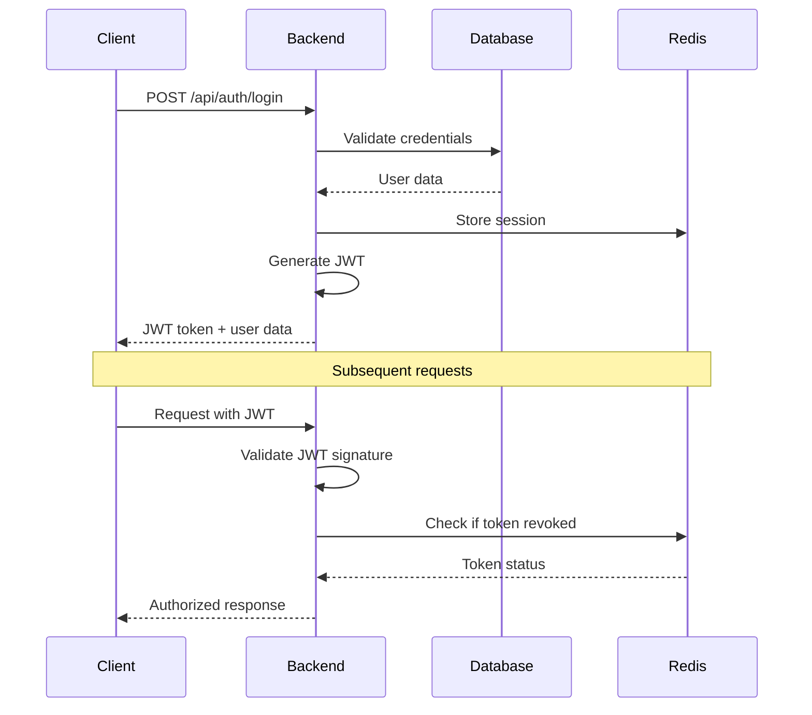

# Security Architecture - Bingo La Perla

## 🛡️ Security Overview

Bingo La Perla implements a comprehensive security architecture following industry best practices for financial applications, with multiple layers of protection from the frontend to the database level.

### Security Principles
1. **Defense in Depth**: Multiple security layers
2. **Zero Trust**: Verify everything, trust nothing
3. **Least Privilege**: Minimal required permissions
4. **Fail Secure**: Secure defaults on failure
5. **Privacy by Design**: Data protection built-in

## 🔐 Authentication Architecture

### JWT Implementation
```typescript
interface JWTPayload {
  userId: string;
  email: string;
  role: 'USER' | 'ADMIN';
  iat: number;        // Issued at
  exp: number;        // Expires at
  jti: string;        // JWT ID for revocation
}
```

**JWT Configuration:**
- **Algorithm**: HS256 (HMAC with SHA-256)
- **Token Lifetime**: 24 hours
- **Refresh Strategy**: Sliding window refresh
- **Revocation**: JTI-based blacklist with Redis

### Authentication Flow


### Password Security
```typescript
// Password hashing configuration
const BCRYPT_ROUNDS = 12;  // ~250ms processing time
const PEPPER = process.env.PASSWORD_PEPPER; // Additional secret

// Password requirements
const PASSWORD_POLICY = {
  minLength: 8,
  maxLength: 128,
  requireUppercase: true,
  requireLowercase: true,
  requireNumbers: true,
  requireSpecialChars: true,
  preventCommonPasswords: true
};
```

## 🔒 Authorization System

### Role-Based Access Control (RBAC)
```typescript
enum UserRole {
  USER = 'USER',
  ADMIN = 'ADMIN'
}

interface Permission {
  resource: string;
  action: 'CREATE' | 'READ' | 'UPDATE' | 'DELETE';
  conditions?: Record<string, any>;
}

const ROLE_PERMISSIONS: Record<UserRole, Permission[]> = {
  USER: [
    { resource: 'games', action: 'READ' },
    { resource: 'bingo-cards', action: 'CREATE', conditions: { owner: 'self' } },
    { resource: 'wallet', action: 'READ', conditions: { owner: 'self' } },
    { resource: 'transactions', action: 'CREATE', conditions: { sender: 'self' } }
  ],
  ADMIN: [
    { resource: '*', action: '*' },  // Full access
    { resource: 'audit-logs', action: 'READ' },
    { resource: 'payment-requests', action: 'UPDATE' }
  ]
};
```

### Protected Route Implementation
```typescript
// Frontend route protection
function ProtectedRoute({ children, requiredRole = 'USER' }) {
  const { isAuthenticated, user } = useAuth();
  
  if (!isAuthenticated) {
    return <Navigate to="/login" />;
  }
  
  if (requiredRole === 'ADMIN' && user?.role !== 'ADMIN') {
    return <Navigate to="/unauthorized" />;
  }
  
  return children;
}

// Backend middleware
const authMiddleware = (requiredRole?: UserRole) => {
  return async (req: Request, res: Response, next: NextFunction) => {
    try {
      const token = extractTokenFromHeader(req);
      const payload = jwt.verify(token, JWT_SECRET) as JWTPayload;
      
      // Check if token is revoked
      const isRevoked = await redis.sismember('revoked_tokens', payload.jti);
      if (isRevoked) {
        throw new Error('Token revoked');
      }
      
      // Role-based access check
      if (requiredRole && payload.role !== requiredRole && payload.role !== 'ADMIN') {
        return res.status(403).json({ error: 'Insufficient permissions' });
      }
      
      req.user = payload;
      next();
    } catch (error) {
      return res.status(401).json({ error: 'Invalid authentication' });
    }
  };
};
```

## 🌐 Network Security

### CORS Configuration
```typescript
const corsOptions = {
  origin: [
    process.env.FRONTEND_URL,
    'https://bingo-la-perla.com',
    'https://www.bingo-la-perla.com'
  ],
  methods: ['GET', 'POST', 'PUT', 'DELETE', 'OPTIONS'],
  allowedHeaders: [
    'Content-Type',
    'Authorization',
    'X-Requested-With',
    'X-API-Key'
  ],
  credentials: true,  // Allow cookies
  maxAge: 86400       // Cache preflight for 24 hours
};
```

### Rate Limiting Strategy
```typescript
// Global rate limit
const globalLimiter = rateLimit({
  windowMs: 15 * 60 * 1000,  // 15 minutes
  max: 100,                   // 100 requests per window
  message: 'Too many requests, please try again later',
  standardHeaders: true,
  legacyHeaders: false
});

// Authentication rate limit
const authLimiter = rateLimit({
  windowMs: 15 * 60 * 1000,  // 15 minutes
  max: 5,                     // 5 login attempts
  skipSuccessfulRequests: true,
  message: 'Too many login attempts, please try again later'
});

// Payment operations rate limit
const paymentLimiter = rateLimit({
  windowMs: 60 * 60 * 1000,  // 1 hour
  max: 10,                    // 10 payment operations per hour
  keyGenerator: (req) => req.user?.userId || req.ip
});
```

### Security Headers (Helmet.js)
```typescript
app.use(helmet({
  contentSecurityPolicy: {
    directives: {
      defaultSrc: ["'self'"],
      styleSrc: ["'self'", "'unsafe-inline'", "https://fonts.googleapis.com"],
      fontSrc: ["'self'", "https://fonts.gstatic.com"],
      scriptSrc: ["'self'", "'unsafe-eval'"],  // For React dev
      objectSrc: ["'none'"],
      imgSrc: ["'self'", "data:", "https:"],
      connectSrc: ["'self'", "wss:", "https:"]
    }
  },
  hsts: {
    maxAge: 31536000,  // 1 year
    includeSubDomains: true,
    preload: true
  },
  noSniff: true,
  frameguard: { action: 'deny' },
  crossOriginEmbedderPolicy: false  // For Socket.IO compatibility
}));
```

## 💰 Financial Security

### Transaction Security
```typescript
interface SecureTransaction {
  id: string;
  userId: string;
  amount: Decimal;
  type: TransactionType;
  signature: string;      // HMAC signature
  timestamp: Date;
  nonce: string;          // Prevent replay attacks
  referenceId: string;    // Unique business reference
}

// Transaction signing
function signTransaction(transaction: Partial<SecureTransaction>): string {
  const payload = [
    transaction.userId,
    transaction.amount,
    transaction.type,
    transaction.timestamp,
    transaction.nonce
  ].join('|');
  
  return crypto
    .createHmac('sha256', process.env.TRANSACTION_SECRET!)
    .update(payload)
    .digest('hex');
}

// Transaction validation
function validateTransaction(transaction: SecureTransaction): boolean {
  const expectedSignature = signTransaction(transaction);
  return crypto.timingSafeEqual(
    Buffer.from(transaction.signature, 'hex'),
    Buffer.from(expectedSignature, 'hex')
  );
}
```

### Wallet Security
```typescript
class WalletSecurity {
  // Daily limit checks
  static async checkDailyLimit(userId: string, amount: Decimal): Promise<boolean> {
    const today = new Date().toISOString().split('T')[0];
    const key = `daily_spending:${userId}:${today}`;
    
    const currentSpending = await redis.get(key) || '0';
    const wallet = await prisma.wallet.findUnique({ where: { userId } });
    
    return parseFloat(currentSpending) + amount <= wallet.dailyLimit;
  }
  
  // Suspicious transaction detection
  static async detectSuspiciousActivity(userId: string, transaction: Transaction): Promise<boolean> {
    const recentTransactions = await prisma.transaction.findMany({
      where: {
        userId,
        createdAt: { gte: new Date(Date.now() - 24 * 60 * 60 * 1000) }
      }
    });
    
    // Check for unusual patterns
    const unusualAmount = transaction.amount > 1000;
    const highFrequency = recentTransactions.length > 20;
    const rapidSuccession = recentTransactions
      .filter(t => new Date().getTime() - t.createdAt.getTime() < 60000).length > 5;
    
    return unusualAmount || highFrequency || rapidSuccession;
  }
  
  // Freeze wallet for investigation
  static async freezeWallet(userId: string, reason: string): Promise<void> {
    await prisma.wallet.update({
      where: { userId },
      data: { isFrozen: true }
    });
    
    await AuditLogger.log({
      action: 'WALLET_FROZEN',
      userId,
      description: `Wallet frozen: ${reason}`,
      severity: 'HIGH'
    });
  }
}
```

## 🔍 Audit & Monitoring

### Comprehensive Audit Logging
```typescript
class AuditLogger {
  static async log(event: AuditEvent): Promise<void> {
    const auditLog = {
      id: generateId(),
      userId: event.userId,
      adminId: event.adminId,
      action: event.action,
      entity: event.entity,
      entityId: event.entityId,
      oldValue: event.oldValue ? JSON.stringify(event.oldValue) : null,
      newValue: event.newValue ? JSON.stringify(event.newValue) : null,
      description: event.description,
      ipAddress: event.ipAddress,
      userAgent: event.userAgent,
      sessionId: event.sessionId,
      severity: event.severity || 'INFO',
      createdAt: new Date()
    };
    
    await prisma.auditLog.create({ data: auditLog });
    
    // Real-time security monitoring
    if (event.severity === 'HIGH' || event.severity === 'CRITICAL') {
      await this.sendSecurityAlert(auditLog);
    }
  }
  
  static async sendSecurityAlert(log: AuditLog): Promise<void> {
    // Integration with monitoring systems
    // Slack, email, or other alerting mechanisms
  }
}
```

### Security Monitoring Dashboard
- **Failed Login Attempts**: Real-time tracking
- **Unusual Transaction Patterns**: ML-based detection
- **API Rate Limit Violations**: Automated blocking
- **Database Query Anomalies**: Performance and security
- **File Upload Monitoring**: Malware scanning

## 🔐 Data Protection

### Encryption at Rest
```typescript
// Sensitive data encryption
class DataEncryption {
  private static readonly ALGORITHM = 'aes-256-gcm';
  private static readonly KEY = crypto.scryptSync(process.env.ENCRYPTION_KEY!, 'salt', 32);
  
  static encrypt(text: string): EncryptedData {
    const iv = crypto.randomBytes(16);
    const cipher = crypto.createCipher(this.ALGORITHM, this.KEY);
    cipher.setAAD(Buffer.from('additional-auth-data'));
    
    let encrypted = cipher.update(text, 'utf8', 'hex');
    encrypted += cipher.final('hex');
    
    return {
      encrypted,
      iv: iv.toString('hex'),
      tag: cipher.getAuthTag().toString('hex')
    };
  }
  
  static decrypt(data: EncryptedData): string {
    const decipher = crypto.createDecipher(this.ALGORITHM, this.KEY);
    decipher.setAAD(Buffer.from('additional-auth-data'));
    decipher.setAuthTag(Buffer.from(data.tag, 'hex'));
    
    let decrypted = decipher.update(data.encrypted, 'hex', 'utf8');
    decrypted += decipher.final('utf8');
    
    return decrypted;
  }
}

// PII fields encryption
const sensitiveFields = ['dni', 'phone', 'bankAccount'];
```

### GDPR Compliance
```typescript
class GDPRCompliance {
  // Data subject access request
  static async exportUserData(userId: string): Promise<UserDataExport> {
    const userData = await prisma.user.findUnique({
      where: { id: userId },
      include: {
        transactions: true,
        bingoCards: true,
        wallet: true,
        depositRequests: true,
        withdrawalRequests: true
      }
    });
    
    // Anonymize sensitive data for export
    return this.anonymizeForExport(userData);
  }
  
  // Right to be forgotten
  static async deleteUserData(userId: string): Promise<void> {
    // Anonymize instead of delete for financial compliance
    await prisma.user.update({
      where: { id: userId },
      data: {
        email: `deleted_${Date.now()}@deleted.com`,
        username: `deleted_${Date.now()}`,
        fullName: '[DELETED]',
        phone: null,
        dni: null
      }
    });
    
    await AuditLogger.log({
      action: 'USER_DATA_DELETED',
      userId,
      description: 'User data anonymized per GDPR request',
      severity: 'MEDIUM'
    });
  }
}
```

## 🚨 Incident Response

### Security Incident Classification
```typescript
enum SecurityIncident {
  UNAUTHORIZED_ACCESS = 'UNAUTHORIZED_ACCESS',
  DATA_BREACH = 'DATA_BREACH',
  SUSPICIOUS_TRANSACTION = 'SUSPICIOUS_TRANSACTION',
  MALWARE_DETECTED = 'MALWARE_DETECTED',
  DDOS_ATTACK = 'DDOS_ATTACK',
  SQL_INJECTION = 'SQL_INJECTION',
  XSS_ATTEMPT = 'XSS_ATTEMPT'
}

class IncidentResponse {
  static async handleSecurityIncident(
    incident: SecurityIncident,
    details: any
  ): Promise<void> {
    // Log incident
    await AuditLogger.log({
      action: 'SECURITY_INCIDENT',
      description: `Security incident detected: ${incident}`,
      severity: 'CRITICAL',
      ...details
    });
    
    // Automated response based on incident type
    switch (incident) {
      case SecurityIncident.SUSPICIOUS_TRANSACTION:
        await this.freezeSuspiciousAccounts(details.userIds);
        break;
      case SecurityIncident.DDOS_ATTACK:
        await this.enableDDOSProtection();
        break;
      case SecurityIncident.UNAUTHORIZED_ACCESS:
        await this.revokeAllUserSessions(details.userId);
        break;
    }
    
    // Alert security team
    await this.notifySecurityTeam(incident, details);
  }
}
```

### Automated Security Responses
1. **Brute Force Detection**: Auto-lock accounts after 5 failed attempts
2. **Suspicious Patterns**: Flag unusual transaction patterns
3. **Geographic Anomalies**: Alert on login from new locations
4. **API Abuse**: Rate limiting and temporary bans
5. **Data Exfiltration**: Monitor large data exports

## 🔒 Security Best Practices Implementation

### Input Validation & Sanitization
```typescript
// Zod schemas for validation
const userRegistrationSchema = z.object({
  email: z.string().email().max(255),
  username: z.string().min(3).max(20).regex(/^[a-zA-Z0-9_]+$/),
  password: z.string().min(8).max(128)
    .refine(validatePasswordStrength, {
      message: "Password does not meet security requirements"
    }),
  fullName: z.string().max(100).optional(),
  dni: z.string().regex(/^\d{8}$/).optional()
});

// SQL injection prevention
// Using Prisma ORM prevents SQL injection by design
const games = await prisma.game.findMany({
  where: {
    status: {
      in: allowedStatuses  // Parameterized query
    }
  }
});
```

### XSS Prevention
```typescript
// Content Security Policy
const cspDirectives = {
  defaultSrc: ["'self'"],
  scriptSrc: ["'self'", "'unsafe-eval'"],
  styleSrc: ["'self'", "'unsafe-inline'"],
  imgSrc: ["'self'", "data:", "https:"],
  fontSrc: ["'self'", "https://fonts.gstatic.com"],
  connectSrc: ["'self'", "wss:", "https:"]
};

// Output encoding in React (automatic)
function UserProfile({ user }) {
  return (
    <div>
      {/* React automatically escapes these values */}
      <h1>{user.fullName}</h1>
      <p>{user.email}</p>
    </div>
  );
}
```

### CSRF Protection
```typescript
// SameSite cookie configuration
const cookieOptions = {
  httpOnly: true,
  secure: process.env.NODE_ENV === 'production',
  sameSite: 'strict' as const,
  maxAge: 24 * 60 * 60 * 1000  // 24 hours
};

// CSRF token validation for state-changing operations
const csrfMiddleware = (req: Request, res: Response, next: NextFunction) => {
  if (['POST', 'PUT', 'DELETE'].includes(req.method)) {
    const token = req.headers['x-csrf-token'];
    if (!validateCSRFToken(token, req.user.sessionId)) {
      return res.status(403).json({ error: 'Invalid CSRF token' });
    }
  }
  next();
};
```

## 📊 Security Metrics & KPIs

### Key Security Indicators
- **Authentication Success Rate**: >99.5%
- **Failed Login Attempts**: <5% of total attempts
- **Average Session Duration**: 45 minutes
- **Password Reset Requests**: <2% of user base monthly
- **Suspicious Transaction Rate**: <0.1%
- **Security Incident Response Time**: <15 minutes
- **Data Breach Risk Score**: Maintained at LOW

### Compliance Certifications Target
- **PCI DSS**: Payment Card Industry compliance
- **SOC 2 Type II**: Security controls audit
- **ISO 27001**: Information security management
- **SBS Peru**: Banking regulator compliance

---

**Security Architecture Version**: 1.0.0
**Last Security Review**: ${new Date().toLocaleDateString('es-PE')}
**Next Audit**: Quarterly security assessment
**Penetration Testing**: Semi-annual third-party testing