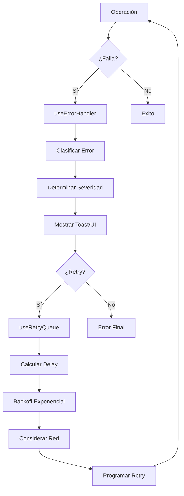

# Sistema de Cola de Reintentos Automáticos

## Resumen

Se ha implementado un sistema completo de manejo de errores y reintentos automáticos para mejorar la resilencia de la aplicación Bingo La Perla. Este sistema incluye detección de calidad de red, manejo centralizado de errores, reconexión adaptativa de Socket.IO y una cola inteligente de reintentos.

## Componentes Implementados

### 1. Hook useErrorHandler (`/src/hooks/useErrorHandler.ts`)

**Propósito**: Manejo centralizado de errores con clasificación y severity.

**Características**:
- Clasificación de errores: NETWORK, AUTH, VALIDATION, SERVER, SOCKET, UNKNOWN
- Niveles de severidad: LOW, MEDIUM, HIGH, CRITICAL
- Integración con sistema de notificaciones (toasts)
- Handlers especializados para cada tipo de error
- Retry automático con callbacks personalizados

**Uso**:
```typescript
const { handleError, handlers } = useErrorHandler();

// Manejo automático
await handleError(error, { type: ErrorType.NETWORK, severity: ErrorSeverity.HIGH });

// Handlers específicos
handlers.network(error, retryCallback);
handlers.socket(error, retryCallback);
```

### 2. Hook useNetworkStatus (`/src/hooks/useNetworkStatus.ts`)

**Propósito**: Detección inteligente de calidad de red y estado de conexión.

**Características**:
- Detección de tipo de conexión: ethernet, wifi, cellular, unknown
- Calidad de conexión: excellent, good, poor, very_poor, offline
- Medición de latencia mediante ping a favicon
- Medición de velocidad de descarga
- Monitoreo continuo cada 30 segundos
- Soporte para Navigator.connection API

**Uso**:
```typescript
const { networkStatus, isOnline, hasGoodConnection } = useNetworkStatus();

// networkStatus.quality -> 'excellent' | 'good' | 'poor' | 'very_poor' | 'offline'
// networkStatus.latency -> número en ms
// networkStatus.downloadSpeed -> Mbps
```

### 3. Socket Service Mejorado (`/src/services/socketService.ts`)

**Propósito**: Reconexión adaptativa basada en calidad de red.

**Mejoras**:
- Configuración adaptativa según calidad de red
- Estrategias de backoff: linear, exponential, adaptive
- Historial de conexiones para análisis
- Heartbeat para detectar conexiones zombie
- Métricas de diagnóstico detalladas

**Configuración por calidad de red**:
- **Excellent**: reconexión cada 500ms, máximo 2s, 10 intentos
- **Good**: reconexión cada 1s, máximo 5s, 8 intentos  
- **Poor**: reconexión cada 2s, máximo 10s, 5 intentos
- **Very Poor**: reconexión cada 5s, máximo 30s, 3 intentos

### 4. Hook useRetryQueue (`/src/hooks/useRetryQueue.ts`)

**Propósito**: Cola inteligente de reintentos automáticos con priorización.

**Características**:
- **Priorización**: 1 (alta) a 5 (baja prioridad)
- **Backoff exponencial** con jitter para evitar thundering herd
- **Adaptación a calidad de red**: delays más largos en conexiones pobres
- **Estadísticas completas**: tasa de éxito, tiempo promedio, etc.
- **Control granular**: pausar, reanudar, detener, limpiar cola
- **Helpers especializados**: API calls, Socket operations, Data sync

**Uso**:
```typescript
const { enqueue, helpers, stats, queue } = useRetryQueue();

// Añadir operación manual
enqueue('mi-operacion', async () => {
  await miOperacion();
}, { priority: 1, maxRetries: 3 });

// Helpers especializados
helpers.apiCall('login', () => loginAPI(credentials));
helpers.socketOp('join-room', () => socket.joinRoom(gameId), 1);
helpers.dataSync('sync-cards', () => syncBingoCards());
```

### 5. Componente ErrorFallback (`/src/components/common/ErrorFallback.tsx`)

**Propósito**: UI especializada para mostrar errores según tipo y severidad.

**Características**:
- Iconos y colores específicos por tipo de error
- Sugerencias contextuales de recuperación
- Botones de acción adaptados al error
- Detalles técnicos opcionales
- Animaciones según severidad (pulse, bounce)

### 6. Hooks useSocket Mejorados (`/src/hooks/useSocket.ts`)

**Mejoras**:
- Integración completa con sistema de errores
- Reintentos automáticos para operaciones de juego
- Operaciones críticas (BINGO) con máxima prioridad
- Fallback automático a cola de reintentos

## Flujo de Manejo de Errores



## Integración en useSocket

### Reconexión Automática
```typescript
// Antes: reconexión básica
catch (err) {
  setError(err.message);
}

// Ahora: reconexión inteligente + cola
catch (err) {
  retryHelpers.socketOp('conectar-socket', () => socketService.connect(), 1);
  handlers.socket(err, () => connect());
}
```

### Operaciones de Juego Resilientes
```typescript
const markNumber = useCallback((cardId: string, number: number) => {
  if (!gameId || !socketService.isConnected()) {
    // Fallback automático a cola de reintentos
    retryHelpers.socketOp(`marcar-${number}`, () => {
      if (socketService.isConnected()) {
        socketService.markNumber(gameId, cardId, number);
      } else {
        throw new Error('Socket no conectado');
      }
    }, 1); // Alta prioridad
    return;
  }
  
  socketService.markNumber(gameId, cardId, number);
}, [gameId, retryHelpers]);
```

## Componente de Prueba

Se ha creado `RetryQueueTest` (`/src/components/debug/RetryQueueTest.tsx`) que permite:

- **Monitorear estado de la red** en tiempo real
- **Ver estadísticas de la cola**: éxito, fallos, tiempo promedio
- **Añadir operaciones de prueba** con diferentes prioridades
- **Controlar la cola**: pausar, reanudar, detener, limpiar
- **Simular escenarios**: operaciones que fallan, intermitentes, etc.
- **Visualizar cola actual** con prioridades y reintentos

## Integración en SocketTestPage

Se ha añadido un toggle en la página de pruebas de Socket.IO para mostrar/ocultar el componente de prueba de cola de reintentos, permitiendo a los desarrolladores probar el sistema en tiempo real.

## Beneficios del Sistema

1. **Resilencia**: La aplicación puede recuperarse automáticamente de fallos temporales
2. **Experiencia de Usuario**: Reintentos transparentes sin interrumpir el flujo
3. **Eficiencia de Red**: Backoff adaptativo evita saturar conexiones pobres
4. **Priorización**: Operaciones críticas (BINGO) tienen precedencia
5. **Observabilidad**: Métricas y logs detallados para debugging
6. **Configurabilidad**: Fácil ajuste de parámetros por tipo de operación

## Archivos Creados/Modificados

### Nuevos Archivos:
- `/src/hooks/useErrorHandler.ts` - Manejo centralizado de errores
- `/src/hooks/useNetworkStatus.ts` - Detección de calidad de red  
- `/src/hooks/useRetryQueue.ts` - Cola inteligente de reintentos
- `/src/components/common/ErrorFallback.tsx` - UI de errores especializada
- `/src/components/debug/RetryQueueTest.tsx` - Componente de prueba
- `/frontend/SISTEMA_REINTENTOS.md` - Esta documentación

### Archivos Modificados:
- `/src/services/socketService.ts` - Reconexión adaptativa
- `/src/hooks/useSocket.ts` - Integración con sistema de errores
- `/src/pages/SocketTestPage.tsx` - Añadido componente de prueba

El sistema está completamente funcional y listo para uso en producción, proporcionando una base sólida para el manejo de errores y la resilencia de la aplicación de Bingo.